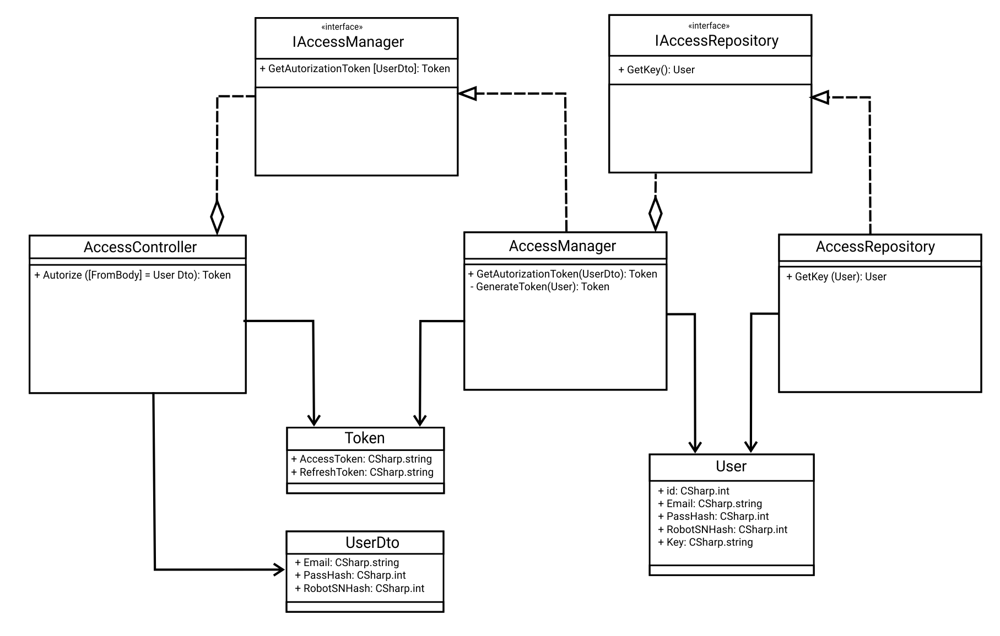
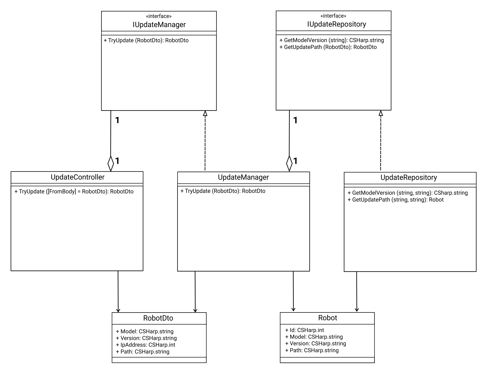
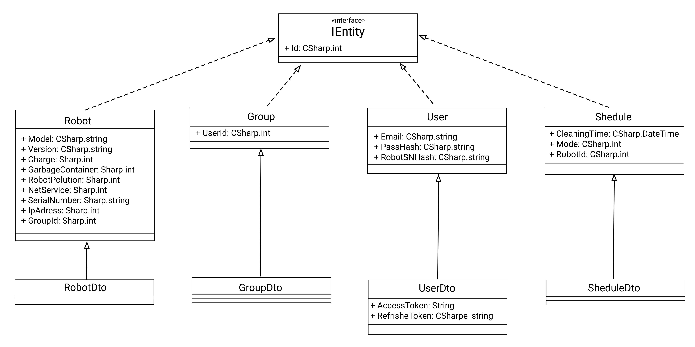
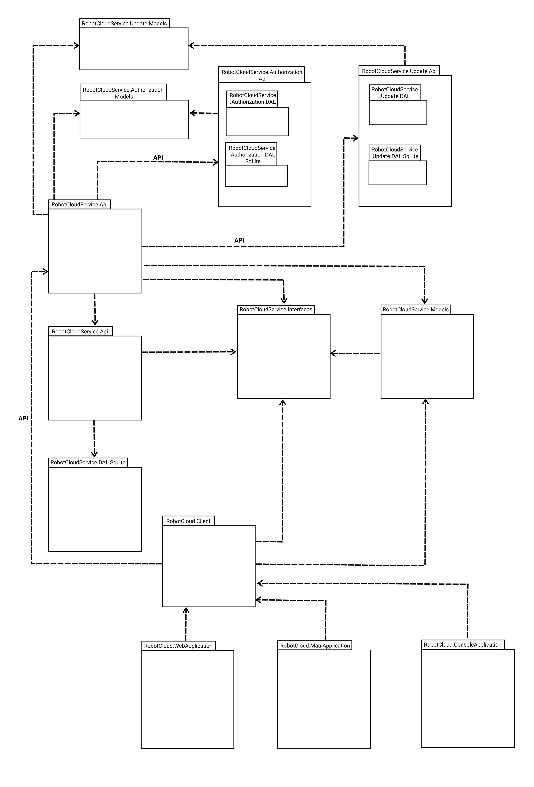

# Архитектура ПО

### Урок 11. Сервис-ориентированные архитектуры

### ЗАДАНИЕ

h. Спроектировать компонент подключения по API к производителю роботов-пылесосов, для обновления прошивок и передачи диагностических данных https://app.diagrams.net/.

i. Спроектировать адаптеры интерфейсов в виде компонент (подключение к БД, шлюзы к интерфейсу, шлюзы к третьим источникам) https://app.diagrams.net/.

j. Спроектировать компонент внешнего конфигурирования для настройки компонент бизнес-логики (параметры конкретного робота) https://app.diagrams.net/.

k. Спроектировать и имплементировать компонент самодиагностики (Self-checking). Который собирает статус работоспоспособности и времени запроса на каждый компонент уровня API Gateway, бизнес-логики и слоя управления данными. Включая технологический интерфейс для мониторинга https://grafana.com/ или https://prometheus.io/ .

l. Выбрать метрики для наблюдения за инфраструктурой на которой будет развёрнуто решение (процессор, память, диск).

### РЕШЕНИЕ

1) Диаграмма_Авторизация

2) Диаграмма_Обновление

3) Диаграмма_Домен

4) Диаграмма_Пакет

